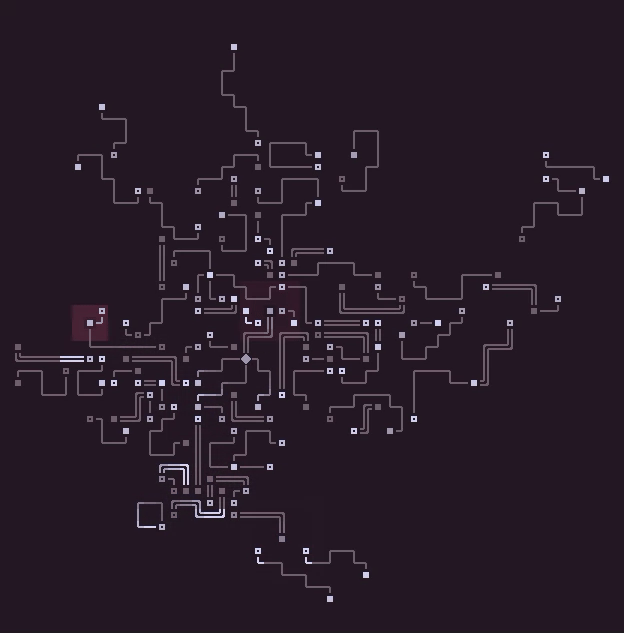

# ascii-cell

A small frontend library for creating and rendering cellular automatons using ASCII graphics.



The current features of `ascii-cell` include:
- Growable and shrinkable grid of cells.
- Consistent cell updates: changes will not affect other cells during a simulation step.
- Efficient pixel font rendering.
- Visual effects that can modify the way cells are rendered.
- Minimal renders: only the cells that have changed are re-rendered.
- Cells can put themselves to sleep, and groups of sleeping cells are not processed or re-rendered.

## Installation

You can install `ascii-cell` using `npm` or `yarn`:

```sh
npm install ascii-cell
# ...or...
yarn add ascii-cell
```

With this method, it's recommended to directly import the different submodules, so that only the relevant code is added to your bundle:

```js
import Simulation from "ascii-cell/simulation";

function MyComponent() {
    const sim = new Simulation({
        // Your simulation settings
    });

    // ...
}
```

For Typescript, you will need to have `compilerOptions.module >= "node16"` in your `tsconfig.json` for the submodules to be available this way,
as they are relying on the `exports` field in this library's `package.json`.

If you wish to use this library without npm, then you can import it from a CDN, like so:

```js
import { Simulation } from "https://cdn.jsdelivr.net/npm/ascii-cell@0.1.0/dist/simulation.js";
```

## Usage

### Creating your own cellular automatons

The easiest way to make your own cellular automaton is to clone this repository and run the included `examples/` folder:

```sh
# You only need to run the following commands once:
git clone https://github.com/adri326/ascii-cell/
cd ascii-cell
npm i

# Whenever you want to run the examples:
npm run dev
```

Then, either change `examples/gol-simulation.ts` to implement your own cellular automaton, or copy it to a new file and tweak `examples/preview.tsx` to point to your new file.

I strongly recommend having a typescript language server to ensure that your cellular automaton is type-checked while you work.

Cellular automatons with `ascii-cell` are defined as one big object, that looks like this:

```ts
import type { SimulationOptions, Simulation } from "ascii-cell/simulation";
import { type Color, colorFromHex } from "ascii-cell/color";

const WHITE = colorFromHex("#ffffff");
const BLACK = colorFromHex("#000000");

type MyState = {
    alive: boolean,
};

const MyCellularAutomaton: SimulationOptions<MyState> = {
    // The state that new cells receives
    defaultState: {
        alive: false,
    },
    // Optional, controls the size of the simulation area.
    // Can be a function if the size is dynamic.
    simulationBounds: {
        x: 0,
        y: 0,
        width: 50,
        height: 50,
    },
    onInit(handle: Simulation<MyState>) {
        // This function is optional, and can be used to initialize cells at the beginning of the simulation.
    },
    onTick(cell: MyState, x: number, y: number, handle: Simulation<MyState>) {
        // This function is run for every cell at every time step,
        // and is used to give them behaviour.

        // You can access the neighboring cells as well as control how the cells should
        // be modified using `handle`.
    },
    getChar(cell: MyState) {
        // Controls the character used to render each cell.
        return cell.alive ? "+" : " ";
    },
    getColor(cell: MyState) {
        // Controls the foreground of each cell.
        return cell.alive ? WHITE : BLACK;
    },
    getBackground(cell: MyState) {
        // Controls the background of each cell.
        return cell.alive ? BLACK : WHITE;
    },
};
```

The `onTick` function is where the magic happens.
Through the `handle` argument, you can query the current state of the neighboring cells
and modify cells.
See the following section for more information on how to do that.

### The `Simulation` API

To be able to use the definition of your cellular automaton, simply call `new Simulation(MyCellularAutomaton)`.

The `Simulation` instance allows you to control and render the simulation from outside, and is passed to the `onTick` and `onInit` function, using the following methods:

- `Simulation::get(x, y)` returns the current value of the cell at `(x, y)`.
- `Simulation::set(x, y, cell)` lets you modify the cell at `(x, y)`. This takes effect immediately, and is therefore not safe to use within `onTick`.
- `Simulation::update(x, y, (previousState) => newState)` lets you modify the cell at `(x, y)` during `onTick`.
  The third argument is called after all the cells have been passed to `onTick`, and should *not* mutate `previousState`.
  The effect of the update will not be observable immediately through `Simulation::get`, ensuring that the simulation stays consistent.
- `Simulation::addEffect(effect)` adds a visual effect to the simulation, see the documentation of `SimulationEffect` for more information.
- `Simulation::clearEffects(x, y)` removes the visual effects currently affecting the cell at `(x, y)`; the other cells will not keep their visual effects.
- `Simulation::getEffects(x, y)` returns the list of visual effects currently affecting the cell at `(x, y)`.
- `Simulation::tick()` does one step of the simulation.
- `Simulation::getTick()` returns the current step number.
- `Simulation::render(canvas, rect, font)` renders the cells within `rect` onto `canvas`, using the font `font`.
  You most likely want to use an instance of `PixelFont` as `font`, although you could use your own implementation.
